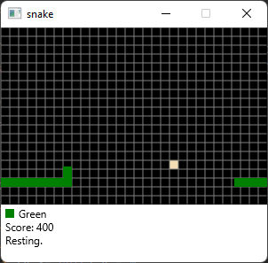
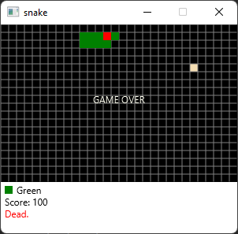
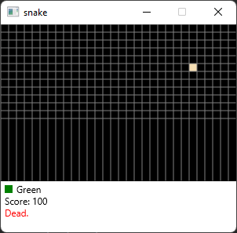

## Setup
This project is developed under OpenJDK 17,
applied JavaFX 17 library,
using IntelliJ as IDE.
#### Environment

If you just want to play this game, you can download the binary file
in release tab, otherwise you will have to set up the environment. 
For development purpose, please follow the instruction below.

- First, install JDK, you can download from [OpenJDK](http://jdk.java.net/java-se-ri/17)
- Go through the official JavaFX getting started guide from [here](https://openjfx.io/openjfx-docs/#introduction)
  - The guide provide basic hello world demonstration on system terminal
  - If you use certain IDE or build tool, you can skip to specific topic
- For IntelliJ environment, you will include two more modules to compile 
the project by adding VM options on configurations,
it is default hidden on the user interface in Windows OS, you can find it
in the top-right corner modify options
- In project structure, set the language level to 17 or greater, or default
- Run or debug project !

#### Gaming
- provide a seed to the application, or leave empty let the application 
decide by itself, the random seed is for specific snake spawn point and 
food generation pattern
- set up the initial length of snake
- control the snake by four arrow keys, press `DIGIT 1` to pause moving
- press `DIGIT 0` to enable debugger mode, press `PAGE_UP` and `PAGE_DOWN`
to move snake back and forth
- score is provided to indicate foods the snake has eaten

## Feature
- snake moves **SMOOTHLY** by sliding in pixels rather than blocks
- snake does not move in opposite direction as last moment
to go through the body
- snake can **REST**, and then keep moving as 
instructed by player
- game over if snake bites itself, press `ENTER` to **RESTART** the game
- in-app debugger allows to manipulate the snake back and forth,
even if the snake is dead

## UseCase
This project is designed to be a guide for cross-platform
open-source small game development in Java,
by implementing the object-oriented design methodology and typical
design patterns like model-view-controller, singleton, template etc. 
The basic function of game should be included in all cases,
e.g., game restart and pause, progress save and load, GUI design.

## Roadmap
- Implement multi-function food on board, like invincible status, 
greater score, speed fruit
- Implement snake molting behavior, reduce snake length on regular timely
manner
- Implement multi-snake initialization and gaming, new snake can be added
while the game is running
- Implement game process loading and automatic saving function, 
file I/O involved

More?

## Architecture
This project applies Model-View-Controller, and Singleton design pattern. 

Table below concludes the process of instantiating different objects.

|    Main     |||||
|:-----------:|:----------------:|:-----:|:---:|:---:|
|   &#8595;   |||||
| Initializer |    &#8594;     | Keypad| &#8594; | (Initializer)
|  |    &#8594;     | Threadloop|  |
|             | |   &#8595;   | |
|||Board|&#8594;| Arbiter|
||||&#8594;| Snake|
||||&#8594;| Food|
|||&#8595;|||
|||Recorder|&#8594;|Trail|
|||&#8595;|||
|||Debugger|||
|||&#8595;|||
|||Painter|||
|||&#8595;|||
|||Messenger|||

<!-- |    Main     |||||
|:-----------:|:----------------:|:-----:|:---:|:---:|
|   &#8595;   |||||
| Initializer |    &#8594;     | Threadloop|  |
|             | |   &#8595;   | |
|||Board|&#8594;| Snake|
||||&#8594;| Food|
|||&#8595;|||
|||Recorder|&#8594;|Trail|
|||&#8595;|||
|||Painter|||
|||&#8595;|||
|||Debugger|||
|||&#8595;|||
|||Messenger||| -->

#### Model-View-Controller
- Point is the basic unit indicates the coordination of objects, like
snake and food
- Snake and food are instantiated on the board, initialization of snake
and food are controlled by arbiter
- Board, debugger, recorder are instantiated on the thread
- Initializer is instantiated as the JavaFX application is started,
and whenever the game is restarted
- Class Trail stores the history behavior of snake in 
length, head, score regarding the time stamp
- Painter will paint the GUI of board, Messenger will provide
information of snake

#### Singleton
Initializer, recorder, debugger, painter, messenger are instantiated
once in the application in 1 thread.
## Demonstration
 \
Playing video

 \
Game over

 \
GUI crashing
## Issues
- GUI might crash after a few minutes of gaming depending on the 
machine, but the logic behind the GUI is working normally.
Restart the application will refresh the GUI and play again.
- Snake might bite itself head-to-head when user invokes the snake
to move in opposite direction of snake body as snake status changes
from resting to moving
- You might rebuild the entire project, if the IDE throws out
error that certain package is not found

## Acknowledge
- Professor Nadeem Ghani \
  https://ecs.syracuse.edu/faculty-staff/nadeem-ghani

- snake project by @Subh0m0y or @hungrybluedev \
https://github.com/Subh0m0y/Snake

